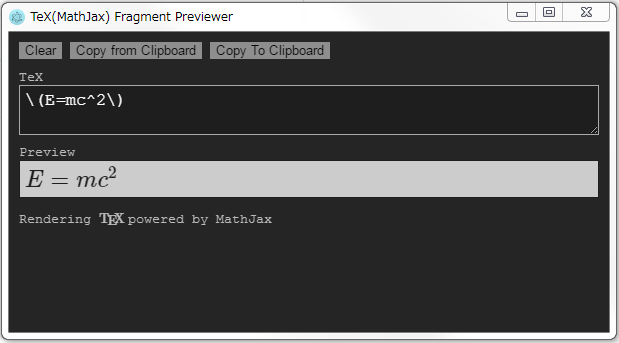

# tex-fragment-preview

## Download
[Windows / macOS](https://github.com/ryo-a/tex-fragment-preview/releases)

## Why did you use Electron for this app? It seems just a single HTML page.
I just want to use `setAlwaysOnTop(true)` and try Electron for a simple app.
